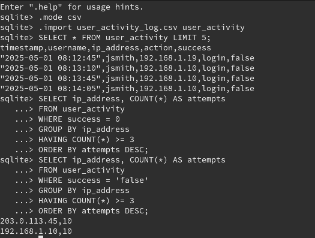

# SQL Failed Login Tracker 🔍

 
 

## 📌 Description
Simple SQL-based security analytics project that tracks failed login attempts from system logs.

- Parsed `.csv` log data with usernames, IPs, and login outcomes.
- Queried for suspicious IP addresses with high login failure counts.
- Used `GROUP BY`, `HAVING`, and `ORDER BY` clauses for meaningful output.

## 📸 Screenshot

## 📁 Files
- `user_activity_log.csv` — Sample log file.
- `summary.md` — This documentation file.
- `security_logs.db` — SQLite database version.

## 🔗 View Full Project
[GitHub Repository](https://github.com/yourusername/sql-failed-login-tracker)
